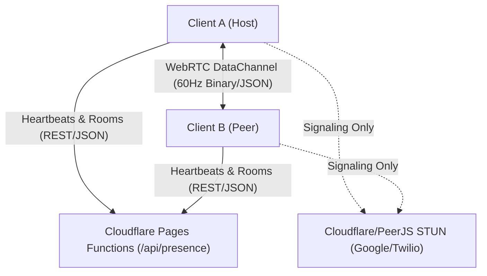

# Game Studio Technical Report: Spin Pong 3D & Curve Battle
**Project Post-Mortem, Architectural Blueprints & Production Lessons**

---

## 1. Executive Summary & Studio Mission

This report documents the architectural, engineering, and product decisions behind the design and deployment of **Spin Pong 3D** (an arcade table tennis simulation with real-time Magnus effect aerodynamics and computer vision controls) and its companion mode, **Curve Battle** (a fast-paced, multi-agent 2D Achtung die Kurve survival experience).

### Key Constraints & Milestones
- **Hosting & Infrastructure Budget**: **$0 / month** continuous operating cost.
- **Backend Architecture**: Serverless Edge runtime running on Cloudflare Pages Workers, accompanied by direct P2P WebRTC data arbitration.
- **Latency Target**: Sub-50ms peer-to-peer frame transmission; zero database read/write bottlenecks.
- **Cross-Platform Delivery**: Responsive WebGL (Three.js) scaling cleanly across desktop browsers, mobile portrait touchscreens, and webcam computer-vision tracking.
- **Live Deployment**: Fully automated CI/CD pipeline on Cloudflare Pages (`https://pong-ay5.pages.dev/`), versioned through SemVer Git tags up to `v1.2.4`.



---

## 2. Core Game Mechanics & Physics Engineering

### 2.1 Spin Pong 3D: Aerodynamic Physics & Magnus Effect
Traditional Pong games use basic raycasts or axis-aligned bounce vectors. For Spin Pong 3D, we engineered a dedicated 3D physics engine (`BallPhysics.ts`) operating on real physical formulas with fixed substep integration:

1. **Magnus Effect Acceleration**:
   $$\vec{a}_{\text{magnus}} = \frac{S_0}{m} (\vec{\omega} \times \vec{v})$$
   Where:
   - $\vec{\omega}$ is the ball's angular spin vector (in radians per second).
   - $\vec{v}$ is the ball's velocity vector.
   - $S_0$ is the Magnus lift coefficient, calibrated to create noticeable dips on topspin, float on backspin chops, and sharp lateral curving on sidespin.

2. **Aerodynamic Drag**:
   $$\vec{F}_{\text{drag}} = -\frac{1}{2} \rho C_d A \|\vec{v}\| \vec{v}$$
   Implemented to ensure smashes explode off the paddle but decelerate realistically through the air, giving players dynamic reaction windows.

3. **Restitution & Friction Matrix**:
   - Table surface impacts resolve normal restitution ($e_y \approx 0.88$) and tangential spin-to-velocity conversion ($v_x' = v_x + r \cdot \omega_z \cdot \mu$), causing heavy topspin balls to kick forward sharply off the bounce and side-spin balls to slide laterally.
   - Paddle collisions evaluate swing speed, contact vector offset from paddle center, and active swing angle bias, granting players intentional direction control without relying on RNG.

### 2.2 Curve Battle: Achtung die Kurve 2D Canvas Dynamics
Curve Battle (`CurveGameMode.ts`) introduces spatial-denial line drawing where each player's trailing ribbon becomes a solid wall for both players.

- **Ribbon Geometry**: Built using dynamic `BufferGeometry` with pre-allocated vertex arrays (`MAX_VERTICES = 15000`) rather than instantiating individual meshes, eliminating GC stutter and keeping draw calls at 1 per trail.
- **Gap Generator**: Random periodic gap intervals ($2.0\text{s} - 3.5\text{s}$ draw, $0.22\text{s}$ gap jump) allow evasive maneuvers and jumping through existing walls.
- **Collision Detection**: Polyline segment collision checks using perpendicular point-to-line-segment distance calculations with a grace window for recent segments to prevent self-collision at the head.

---

## 3. Autonomous Artificial Intelligence (AI) Design

A critical insight gained during playtesting: **players immediately detect naive AI that relies on raw reaction speeds or drives blindly into walls.**

### 3.1 Pong 3D AI (`AIController.ts`)
- **Difficulty Scaling**: Novice, Pro, and Champion.
- **Predictive Trajectory Interception**: Rather than chasing where the ball *currently is*, the AI uses numerical projection to calculate exactly where the ball will intersect the CPU baseline $Y/Z$ plane, factoring in Magnus curves.
- **Humanized Error Margins**:
  - Novice AI has a reaction delay ($120\text{ms}$) and positioning noise ($\pm 18\text{cm}$).
  - Champion AI reads incoming spin, steps forward to smash weak floats, and applies counter-topspin drives.

### 3.2 Curve Battle Tactical Bot AI (`CurveController.ts`)
The bot was redesigned from a simple single-ray sensor into a tactical predator:
1. **Multi-Probe Wing Sampling & Canyon Avoidance**:
   - The bot fires predictive forward rays plus left/right diagonal sampling probes. If a candidate turn direction reveals a closed pocket (volume of blocked endpoints), the bot recognizes it as a dead-end canyon and avoids it.
2. **Dynamic Wall-Pinning**:
   - If the player is within $1.4\text{m}$ of any perimeter wall, the bot identifies this trapped state and steers diagonally across the player's escape angle, cutting off their return to the open arena and pinning them into the boundary.
3. **Trajectory Interception (Cut-Off Maneuvers)**:
   - Bot projects the player's position $25\text{–}35$ frames ahead and actively maneuvers to cross their forward path, turning open space into deadly trail ribbon.

---

## 4. Networking Architecture & Zero-Cost Server Model

Building a multiplayer game without monthly server overhead requires shifting heavy compute and game state to the edges and clients.

### 4.1 Serverless Edge Presence (`functions/api/presence.ts`)
Cloudflare Pages provides edge worker execution at zero cost. We utilized an in-memory edge registry for peer matchmaking and lobby rooms:
- **Zero Database Requirement**: Ephemeral maps store active player heartbeats (`activePeers`) and public rooms (`activeRooms`).
- **Heartbeat & Expiration**: Peers ping every $2\text{s}$ to $4\text{s}$. If a client closes the tab or drops connection, the edge worker automatically purges their presence after $20\text{s}$, preventing stale "ghost" rooms.
- **Room Lifecycle**: Hosts register a room name, target score, and game mode (`PONG` vs `CURVE`). Clients receive room lists with active occupancy and latency metrics.

### 4.2 WebRTC Peer-to-Peer Data Arbitration (`NetworkManager.ts`)
Once two clients match or join a lobby room:
1. **Signaling**: WebRTC handshakes are facilitated via PeerJS public cloud brokers (using Google and Twilio public STUN servers for NAT traversal).
2. **DataChannel Execution**: All frame data travels directly between client browsers via binary/JSON DataChannels with zero intermediate servers:
   - **Paddle & Ball Synchronization**: 60Hz updates.
   - **Host Arbitration**: To prevent split-brain physics or score conflicts, the **Room Host** acts as the authoritative arbitrator for ball velocity, point scoring, and physics collision checks. The client acts as a predictive renderer, sending local paddle input.
   - **Local BroadcastChannel**: Multi-tab testing on the same machine connects instantly via native browser `BroadcastChannel` APIs without even touching the internet.

---

## 5. Visual Rendering, VFX & Interactive Audience

The visual presentation balances retro arcade aesthetic with modern 3D immersion.

### 5.1 Three.js Stadium & Audience Simulation (`Stadium.ts`)
- **Full Stadium Surround**: Bleachers wrap around 3 sides of the court (Back, Left, and Right flanks) with multi-colored spectators.
- **Dynamic Head Tracking**: Spectators calculate the world-space angle of the ball (in Pong) or the lead player (in Curve) and rotate their heads in real time to track the action.
- **Mexican Wave Celebrations**: Scoring points or crashing in Curve triggers staggered jumping animations where spectators pump their articulated arms into the air.
- **Z-Fighting Resolution**: In Curve mode, the wooden court floor and barrier meshes are automatically hidden (`setCourtVisible(false)`), and the 2D arena floor is elevated to $Y = 0.04\text{m}$, eliminating depth buffer flickering against the top-down camera.

### 5.2 Computer Vision Webcam Controls (`WebcamController.ts`)
- **Zero Heavy ML Dependencies**: Instead of loading hundreds of megabytes of heavy TensorFlow models, we built a lightweight frame-difference pixel tracker running on raw `HTMLVideoElement` canvas data:
  - Tracks horizontal hand centroid for paddle positioning.
  - Detects rapid vertical swipe vectors ($dY/dt$) to trigger topspin smashes and backspin chops.

---

## 6. Security Hardening & Production Operations

Following our security audit, the production build was hardened for Cloudflare Pages deployment:

### 6.1 HTTP Security Headers (`public/_headers`)
```http
/*
  X-Frame-Options: DENY
  X-Content-Type-Options: nosniff
  Referrer-Policy: strict-origin-when-cross-origin
  Strict-Transport-Security: max-age=31536000; includeSubDomains; preload
  Permissions-Policy: camera=(self), microphone=(), geolocation=(), interest-cohort=()
  Content-Security-Policy: default-src 'self'; script-src 'self' 'unsafe-inline'; style-src 'self' 'unsafe-inline' https://fonts.googleapis.com; font-src 'self' https://fonts.gstatic.com data:; img-src 'self' data: blob:; media-src 'self' blob:; connect-src 'self' https://0.peerjs.com wss://0.peerjs.com https://*.peerjs.com wss://*.peerjs.com; frame-ancestors 'none'; object-src 'none'; base-uri 'self';
```
- **Clickjacking Protection**: `X-Frame-Options: DENY` and `frame-ancestors 'none'` prevent malicious iframe embedding.
- **XSS & Injection Protection**: Strict CSP limits connections exclusively to self and authorized PeerJS signaling servers.
- **DOM Sanitization**: User-created room names and player nicknames pass through an `escapeHtml` sanitizer before rendering in the DOM, preventing script injection.

---

## 7. Studio Recommendations for Scaling Future Games

For launching a commercial game development studio based on these foundations, we recommend adopting the following technical principles:

1. **Deterministic Lockstep or Authoritative Rollback**:
   - For fast-paced 3D multiplayer games, expand the Host-Client model into an authoritative server or deterministic rollback (GGPO-style) if competitive stakes are introduced.
2. **Asset Pipeline & Geometry Instancing**:
   - Always pre-allocate vertex buffers for procedural graphics (trails, particles, crowds) rather than instantiating individual Three.js objects.
3. **Zero-Cost Prototyping Infrastructure**:
   - Cloudflare Pages Workers + WebRTC P2P provides an ideal $0-overhead foundation for MVP multiplayer testing before investing in dedicated game server fleets (e.g., Agones, AWS GameLift).
4. **Adaptive Device-First UI**:
   - Maintain a unified HUD layer that dynamically checks screen aspect ratio and touch capabilities, adjusting camera FOV and swapping between keyboard hints and touch steering zones on the fly.
